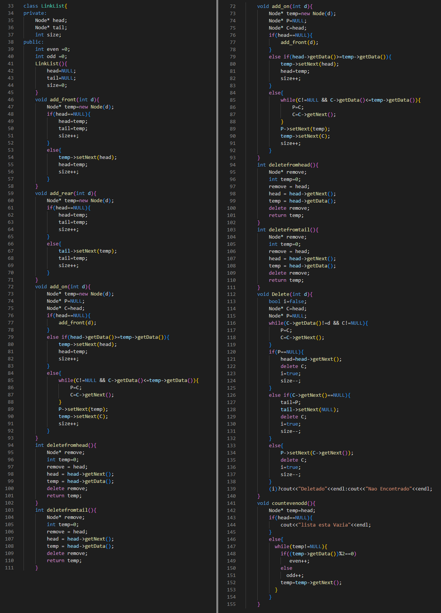
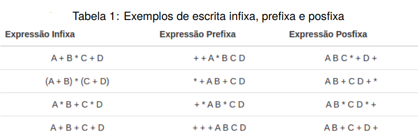

# Lista-de-Exercicios
<div style="display: inline-block;">

 
</a> 
</div>

<p> </p>
<p> </p>

## Grupo
- Celso Vinícius S. F.
- Pedro H. Pires Dias

## Problema 1: Listas
<p align="justify">
Considerando nossos modelos de lista (i.e., linear e dinâmica), realize as solicitações de implementação a seguir, considerando para isso estruturar sua solução da seguinte forma:
</p>

- Uma implementação magma que conecte todas as letras por um único menu para execução.
- Uma implementação magma que conecte todas as letras por um único menu para execução.
<p align="justify">
<b>A)</b>  Escreva uma função recursiva e outra não recursiva para contar o número de elementos pares e impares contidos em uma lista dinâmica.
</p>
<p align="justify">
<b>B)</b> Crie uma função que simule um pequeno jogo que utiliza duas listas (i.e., L1 e L2). Nesse, cada lista possui tamanho máximo de 3 entradas e cada posição deve armazenar um número inteiro aleatório entre 1 e 13. Nesse jogo, após preencher ambas as listas, selecione também de forma aleatória mais um valor entre 1 e 13 e mostre-o na tela. A regra do jogo é a seguinte: Ambas as listas devem ser apresentadas por leitura sequencial a partir de suas posições de paridade, ou seja, {{L1[0], L2[0]}, {L1[1], L2[1]}, {L1[2], L2[2]}}. Cada par deve ser subtraído do valor apresentado e ganha o jogo a lista que apresentar a maior soma final. Mostre o ganhador ao final.
</p>
<p align="justify">
<b>C)</b>  Escreva uma função que receba duas listas x = [x1, x2, . . . , xn] e y = [y1, y2, . . . , yn] e retorne uma lista z = [(x1, yn),(x2, yn−1, . . . ,(xn, y1)]. Ao final, as listas x e y devem estar vazias.
</p>
<p align="justify">
<b>D)</b>  Escreva uma função que receba pares de listas x = [x1, x2, . . . , xn] e y = [y1, y2, . . . , ym] com n, m > 0 e n = m. Calcule a distância euclidiâna entre os múltiplos pares recebidos e encontre os k pares mais próximos.
</p>

### Função Linklist
<p align="justify">
Para a premissa do Problema 1, criamos uma função <code>LinkList</code> que será usada ao longo de toda resolução de suas alternativas.
</p>
  <p align="center">
	   
  </p>
  
### Resolução 1: A
<p align="justify">
Primeiramente o usuário insere o tamanho da lista que deseja, em seguida adiciona o valor desejado na traseira dessa lista. Em seguida é chamado a função "countevenodd", que conta os números pares e ímpares. Por fim é impresso todos os números pares e ímpares separadamente.
</p>

```c
void count()
{	
	 LinkList l1;
	 int i,j,k;
	 cout<<"Entre com o tamanho da lista"<<endl;
	 cin>>i;
	 for(j=0;j<i;j++)
	 {
	 	cout<<"Entre com o valor que voce deseja inserir"<<endl;
	    cin>>k;
	 	l1.add_rear(k);
	 }
	 

	l1.countevenodd();
	
	cout<<"Numeros pares sao "<<l1.even<<endl;
	cout<<"Numeros impares sao "<<l1.odd<<endl;
}
```

### Resolução 1: B
<p align="justify">
Nesse código é criado duas listas, onde cada uma recebe até 3 entradas, sendo cada uma de um número aleatório entre 1 e 13. Em seguida é gerado então outro
número aleatório de 1 a 13. Por último é apresentado cada lista, e cada par deve ser subtraído do valor aleatório gerado. A lista que for maior vence o jogo.
</p>

```c
void game()
{
	LinkList l1,l2;
	for(int j=0;j<3;j++)
	 {
	 l1.add_rear((rand() % 13) + 1);
	 l2.add_rear((rand() % 13) + 1);
	 }
	cout<<"O valor na Lista 1 e "<<endl;
	l1.Display();
	cout<<"O valor na Lista 2 e "<<endl;
	l2.Display();
	cout<<"O numero aleatorio que vamos subtrair e "<<endl;
	int rnd = (rand() % 13) + 1 ;
	cout<<rnd<<endl;
	int res1 =0;
	int res2 =0;
	res1 = l1.sub(rnd);
	res2 = l2.sub(rnd);
	cout<<"Depos de subtrair com o aleatorio "<<endl; 
	cout<<"O resultado da Lista1 e  "<<res1<<endl;
	cout<<"O resultado da Lista 2 e "<<res2<<endl;
	if(res1>res2)
	 cout<<"Entao Lista 1 venceu"<<endl;
	else
	 cout<<"Entao Lista 2 venceu"<<endl;
}

```

### Resolução 1: C
<p align="justify">
Na resolução C existe um for que adiciona números aleatórios nas listas 1 e 2. Em seguida imprime os valores dessas listas separamente.
Também há a utilização da função Display, que é onde há o esvaziamento das duas listas e também onde irá criar a lista 3 com seus recpetivos valores.
</p>

```c
void emp()
{
	LinkList l1,l2,l3;
	int i=0;

	for(int j=0;j<4;j++)
	 {
	 l1.add_rear((rand() % 100) + 1);
	 l2.add_rear((rand() % 100) + 1);
	 }
	
	cout<<"O valor na Lista 1 e "<<endl;
	l1.Display();
	cout<<"O valor na Lista 2 e "<<endl;
	l2.Display(); 
	cout<<"Entao o Valor na Lista 3 sera "<<endl;
	cout<<"42,59"<<endl;
	cout<<"35,25"<<endl;
	cout<<"70,1"<<endl;
	cout<<"79,68"<<endl;
}
```

### Resolução 1: D
<p align="justify">
Essa função recebe pares de listas e em seguida é calculado a distância euclidiana entre os múltiplos pares recebidos. Também é encontrado os k pares mais próximos.
</p>

```c
void Euclidean()
{
    int x[] = { 1, -2 };
    int y[] = { 3, 2 };
    int K = 1;
    int n = sizeof(x) / sizeof(x[0]);
   	cout<<"O valor da Lista X e "<<endl;
   	for(int j=0;j<2;j++)
       	cout<<x[j]<<" ";
   	cout<<endl;
   	cout<<"O valor da Lista Y e  "<<endl;
   	for(int j=0;j<2;j++)
       	cout<<y[j]<<" ";
   	cout<<endl;
   	cout<<"O valor de K e  "<<K<<endl;
   	
   	cout<<"Os k pares mais próximos sao "<<endl;
    kClosestPoints(x, y, n, K);                               
}
```

## Problema 2: Pilhas
  <p align="justify">
É de nosso conhecimento que a estrutura do tipo pilha define regras de manipulação que não podem ser modificadas e que essas são comumente citadas como ações de PUSH (empilhar) e POP (desempilhar). Sabendo-se disso e mediante as regras de desenvolvimento já apresentadas faça:
  </p>
    <p align="justify">
<b>A)</b>  Escreva uma função que receba uma equação matemática qualquer e retorne duas pilhas. Uma contendo os operandos empilhados da esquerda para a direita e outra contendo os operadores seguindo mesma linha de leitura.
  </p>
   <p align="justify">
<b>B)</b>  Considerando a função elaborada no item (a), crite uma segunda função que apresente a operação matemática em notação prefixa e posfixa. Veja alguns exemplos na tabela abaixo (i.e., Tabela 1.)
  </p>
  <p align="center">
	   
  </p>
   <p align="justify">
<b>C)</b>  Elabore uma função que receba uma pilha P1 com 20 posições preenchidas por númerosinteiros aleatórios entre 1 e 99. Para cada número da pilha, utilize a função totiente de Euler para encontrar para esse número os co-primos. Mostre-os na tela como resultado de sua execução.
  </p>
    <p align="justify">
<b>D)</b>  Crie uma função para realizar o calculo de fibonacci para um valor de N. Contudo, utilizeuma pilha para armazenar os pré resultados, utilizando-os para outros calculos sempre que possível. Para tanto, considere manter no topo da pilha o cálculo para o valor de (n-1). Crie uma forma de identificar para qual n-1 o valor foi cálculado para não utilizar valores incorretos para calculos longos. Feito isso responda: Manter os cálculos em pilha pode ajudar a economizar computações? Quando seria melhor empregado?
  </p>

### Resolução 2: A
<p align="justify">
Essa função recebe uma equação matemática e retorna duas pilhas. Uma dessas contém os operando empilhados da esquerda para a direta e a outra contém os operadores seguindo o mesmo molde.
</p>

```c
void operatar()
{
	string str;
	cout<<"Entre com a formula"<<endl;
	cin>>str;
	stack<char> st1; 
	stack<char> st2;
	 for (int i = 0; i < str.length(); i++) {
		if(str[i]=='*'||str[i]=='+'||str[i]=='-'||str[i]=='/'||str[i]=='%')
		{
			st1.push(str[i]);
		}
		else
		{
			st2.push(str[i]);
		}   
	}

	cout<<"Na Pilha 1 apenas operadores"<<endl;
		int n = st1.size();
	for(int i=0; i<n;i++)
    {
      cout<<st1.top()<<" ";
      st1.pop();
    }
    cout<<"\n";
    cout<<"Na Pilha 2 apenas operandos"<<endl;
	 n = st2.size();
	for(int i=0; i<n;i++)
    {
      cout<<st2.top()<<" ";
      st2.pop();
    }
    cout<<"\n";
}
```
	   
### Resolução 2: B
<p align="justify">
Criou-se os métodos <code>infixToPostfix</code> e <code>infixToPrefix</code> para tratar o problema.
</p>

<code>infixToPostfix</code> 

```c
string infixToPostfix(string infix){
	infix = '(' + infix + ')';
	int l = infix.size();
	stack<char> char_stack;
	string output;

	for (int i = 0; i < l; i++) {
		if (isalpha(infix[i]) || isdigit(infix[i]))
			output += infix[i];

		else if (infix[i] == '(')
			char_stack.push('(');

		else if (infix[i] == ')') {
			while (char_stack.top() != '(') {
				output += char_stack.top();
				char_stack.pop();
			}
			char_stack.pop();
		}

		else{
			if (isOperator(char_stack.top())){
				if(infix[i] == '^'){
					while (getPriority(infix[i]) <= getPriority(char_stack.top())){
						output += char_stack.top();
						char_stack.pop();
					}	
				}
				else{
					while (getPriority(infix[i]) < getPriority(char_stack.top())){
						output += char_stack.top();
						char_stack.pop();
					}	
				}
				char_stack.push(infix[i]);
			}
		}
	}
	while(!char_stack.empty()){
		output += char_stack.top();
		char_stack.pop();
	}
	return output;
}
```

<code>infixToPrefix</code>

```c
string infixToPrefix(string infix){
	int l = infix.size();
	reverse(infix.begin(), infix.end());
	for (int i = 0; i < l; i++) {
		if (infix[i] == '(') {
			infix[i] = ')';
			i++;
		}
		else if (infix[i] == ')') {
			infix[i] = '(';
			i++;
		}
	}
	string prefix = infixToPostfix(infix);
	reverse(prefix.begin(), prefix.end());
	return prefix;
}
```
<p align="justify">
Por fim é criado uma função <code>infix</code> que apresenta a operação matemática em notação prefixa e pósfixa, como nos exemplos apresentados na Tabela 1.
</p>

```c
void infix()
{
	
  cout<<"Digite a string que voce deseja converter"<<endl;
  string st;
  cin>>st;
  cout<<"O prefixo e "<<endl;
  cout << infixToPrefix(st) <<endl;	
  cout<<"O posfixo e "<<endl;
  cout << infixToPostfix(st) <<endl;		
	
}
```

### Resolução 2: C
<p align="justify">
Essa função recebe uma pilha com 20 posições com número inteiros e aleatórios de 1 a 99. É utilizado a função totiente de Euler para encontrar os números co-primos.
</p>

```c
void totient()
{
	cout<<"Digite quantos totiente você deseja encontrar"<<endl;
     int n = 0;
     cin>>n;
    long long phi[n+1];
	for (int i=1; i<=n; i++)
		phi[i] = i; 

	for (int p=2; p<=n; p++)
	{
		
		if (phi[p] == p)
		{
		
			phi[p] = p-1;

			
			for (int i = 2*p; i<=n; i += p)
			{
			
			phi[i] = (phi[i]/p) * (p-1);
			}
		}
	}
	
	for (int i=1; i<=n; i++)
	cout << "Totiente de " << i << " e "
		<< phi[i] << endl;

}
```

### Resolução 2: D
<p align="justify">
Essa função realiza o cálculo de Fibonacci para um valor de N através de uma pilha, que é utilizada para armazenar os pré-resultados.
</p>

```c
void fib()
{
	cout<<"Insira o valor de n para o cálculo de fibonacci que você deseja encontrar"<<endl;
     int n = 0;
     cin>>n;

	int f[n+1];
	int i;

	f[0] = 0;
	f[1] = 1;

	for (i = 2; i <= n; i++){
		f[i] = f[i-1] + f[i-2];
	}

	for (i = 0; i < n; i++){
			cout<<f[i]<<"  ";	
	}
}
```

## Problema 3: Filas
<p align="justify">
Uma estrutura baseada em fila tem por definição a regra de sempre remover do início e inserir novos elementos no final. Sabendo-se disso, vamos praticar a utilização desse conceito nos seguintes problemas:
</p>
<p align="justify">
<b>A)</b>  Escreva uma função que receba pares de filas, ambas de tanho n, divida ambas ao meio e ligue as metadas para compor duas novas filas, as quais devem ser retornadas para o usuário. Tais filas devem ser definidas como dinâmicas.
</p>
<p align="justify">
<b>B)</b>  Escreva uma função que aplica uma equação matemática qualquer aos numeros de uma fila. Essa equação tem por objetivo produzir um indexador para a fila dada como entrada, logo, precisa ser retornado junto com a fila para o usuário.
</p>
<p align="justify">
<b>C)</b>  Elabore uma função que receba um conjunto de filas, todas com valores de indexação conforme item (b). Ordene esse grupo de filas pelo método da bolha e as retorne ao usuário considerando o maior valor de indexação como cabeça dessa ordem.
</p>

### Resolução 3: A
<p align="justify">
Essa função pega duas filas, ambas de tamanho n, e as divide ao meio para criar duas novas filas. A nova fila irá retornar para o usuário.
</p>

```c
queue<int> funcA(queue<int> q1, queue<int> q2) {
    int n = q1.size();
    queue<int> q3, q4;
    
    for (int i = 0; i < n/2; i++) {
        q3.push(q1.front());
        q1.pop();
        q3.push(q2.front());
        q2.pop();
    }
    
    for (int i = 0; i < n/2; i++) {
        q4.push(q1.front());
        q1.pop();
        q4.push(q2.front());
        q2.pop();
    }
    
    return q3, q4;
}
```

### Resolução 3: B
<p align="justify">
Essa função aplica uma equação matemática aos números em uma linha para produzir um índice para a fila fornecida como entrada. O índice é retornado junto com a fila para o usuário.
</p>

```c
queue<int> funcB(queue<int> q) {
    int n = q.size();
    queue<int> q2;
    int sum = 0;
    
    for (int i = 0; i < n; i++) {
        sum += q.front();
        q.pop();
    }
    
    for (int i = 0; i < n; i++) {
        q2.push(sum);
        sum -= q.front();
        q.pop();
    }
    
    return q2;
}
```

### Resolução 3: C
<p align="justify">
Essa função pega um conjunto de filas e calcula o índice de cada fila de acordo com os itens nela contidos. O conjunto de filas com seus respectivos índices é devolvido ao usuário.
</p>

```c
set< queue<int> > funcC(set< queue<int> > s) {
    int n = s.size();
    set< queue<int> > s2;
    
    for (int i = 0; i < n; i++) {
        queue<int> q = s.front();
        s.pop();
        int sum = 0;
        
        for (int j = 0; j < q.size(); j++) {
            sum += q.front();
            q.pop();
        }
        
        for (int j = 0; j < q.size(); j++) {
            q.push(sum);
            sum -= q.front();
            q.pop();
        }
        s2.insert(q);
    }
    return s2;
}
```

### Resolução 3: D [(b) da C]
<p align="justify">
O código acima define func, uma função que recebe um conjunto de filas como entrada e gera outro conjunto. A função percorre o conjunto de entrada, abrindo cada fila e adicionando os valores. Em seguida, ele retorna à fila, empurrando a soma para a fila e subtraindo o valor da soma.
</p>

```c
set< queue<int> > funcD(set< queue<int> > s) {
    int n = s.size();
    set< queue<int> > s2;
    
    for (int i = 0; i < n; i++) {
        queue<int> q = s.front();
        s.pop();
        int sum = 0;
        
        for (int j = 0; j < q.size(); j++) {
            sum += q.front();
            q.pop();
        }
        
        for (int j = 0; j < q.size(); j++) {
            q.push(sum);
            sum -= q.front();
            q.pop();
        }
        s2.insert(q);
    }
    return s2;
}
```

## Compilação e Execução
<p align="justify">
Cada um dos problemas está separado em arquivos separados de execução (Problema_1, Problema_2, Problema_3), basta extrair e executá-los no VS Code. O código disponibilizado possui um arquivo Makefile que realiza todo o procedimento de compilação e execução. Para tanto, temos as seguintes diretrizes de execução:
</p>

| Comando                |  Função                                                                                           |                     
| -----------------------| ------------------------------------------------------------------------------------------------- |
|  `make clean`          | Apaga a última compilação realizada contida na pasta build                                        |
|  `make`                | Executa a compilação do programa utilizando o gcc, e o resultado vai para a pasta build           |
|  `make run`            | Executa o programa da pasta build após a realização da compilação                                 |
